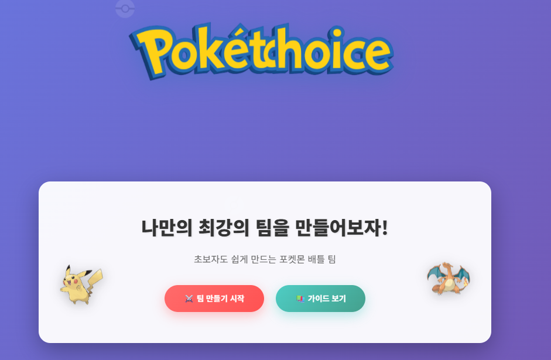

# 

# 🧢 Poketchoice  
### 포켓몬 배틀 초보자들을 위한 가이드라인 사이트

---

## 🎯 프로젝트 개요
**Poketchoice**는 포켓몬 배틀 입문자들이 손쉽게 팀을 구성하고,  
상성 및 기술 배치를 효율적으로 이해할 수 있도록 돕는 웹사이트입니다.  
배틀 초보자들이 **팀 빌딩과 전략 구성을 한눈에 파악**할 수 있도록 제작되었습니다.

---

## ⚙️ 주요 기능
- 🧩 **팀 만들기** — 사용자가 원하는 포켓몬으로 직접 팀 구성  
- 🧠 **추천 팀 조합** — AI 기반 혹은 데이터 기반으로 시너지 높은 팀 추천  
- 🔥 **상성표** — 타입별 상성표 및 피해 배율 정보 제공  
- ⚔️ **포켓몬별 추천 기술 배치도** — 각 포켓몬의 추천 기술 셋 시각화  
- 🎒 **지닌 아이템 추천** — 포켓몬별로 효과적인 아이템 자동 제안  
- 📈 **전략 분석 도구 (추가 예정)** — 팀 구성 효율 및 약점 분석

---

## 📷 미리보기

---

## 📄 라이선스
이 프로젝트는 MIT 라이선스로 배포될 예정입니다.  
자유롭게 수정, 배포 가능하되 출처 명시를 권장합니다.

---

👑 **Poketchoice — 포켓몬 배틀 입문자들의 첫걸음을 함께합니다!**
